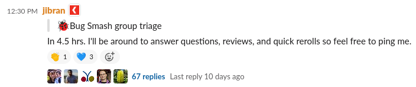

Let's try something new...

When I set the site up, I though what would be a good idea for daily updates? I came to conclusion, how about weekly
Drupal contribution updates. It will be challenging, every Saturday you have to think back what you have contributed,
but let's go with it. 🙂

## Bug Smash Initiative

This week was interesting, at the start of the week I was thinking that we, the bug-smashers[^1], hadn't been doing
group triage sessions[^2], lately. So, I left a reminder about the group triage around three hours before the session,
saying I'd be around to participate in group triage session. We started a thread from that message and discussed a
bunch of issues.

[][bug-smash-group-triage-sessions-reminder-thread]{:target="_blank"}

I had so much fun working with fellow bug-smashers that next day I left another message, and we started another thread
form it. 😁

[][follow-up-bug-smash-group-triage-session]{:target="_blank"}

Thanks to fellow Drupal community members for helping with group triage:

* [@Kristen Pol][kristen-pol]{:target="_blank"}
* [@quietone][quietone]{:target="_blank"}
* [@Lendude][Lendude]{:target="_blank"}
* [@larowlan][larowlan]{:target="_blank"}

There is a saying in Urdu language: 

قطرہ قطرہ دریا بنتا ہے

Translation: Little drops of water make a mighty ocean

Meaning: Every bit helps

## Coding contributions

As a coding contribution, I only re-rolled one patch core patch [Upgrade tests to HTML5][2441373-71]{:target="_blank"}
and found a typo in shiny new [drupal once npm package][drupal-once]{:target="_blank"}
[Fix a typo in Using a single element Example][3199794]{:target="_blank"} but, I did review a few issues this week.

[drupal-slack]: https://www.drupal.org/slack
[bug-smash]: https://drupal.slack.com/archives/C014QES6HSQ
[drupal-core-calendar]: https://calendar.google.com/calendar/embed?src=drupalcorecalendar%40association.drupal.org&ctz=Australia%2FSydney
[bug-smash-group-triage-sessions-reminder-thread]: https://drupal.slack.com/archives/C014QES6HSQ/p1614043805006600
[follow-up-bug-smash-group-triage-session]: https://drupal.slack.com/archives/C014QES6HSQ/p1614134164024800
[kristen-pol]: https://www.drupal.org/u/kristen-pol
[quietone]: https://www.drupal.org/u/quietone
[Lendude]: https://www.drupal.org/u/lendude
[larowlan]: https://www.drupal.org/u/larowlan
[2441373-71]: https://www.drupal.org/project/drupal/issues/2441373#comment-14010708
[drupal-once]: https://www.drupal.org/project/once
[3199794]: https://www.drupal.org/project/once/issues/3199794

[^1]: We hang out in Drupal [slack][drupal-slack]{:target="_blank"} [#bug-smash][bug-smash]{:target="_blank"} channel. Come say hi!

[^2]: In [Drupal core calendar][drupal-core-calendar]{:target="_blank"} there are two slots reserved for "🐞Bug Smash group triage" every fortnight.
